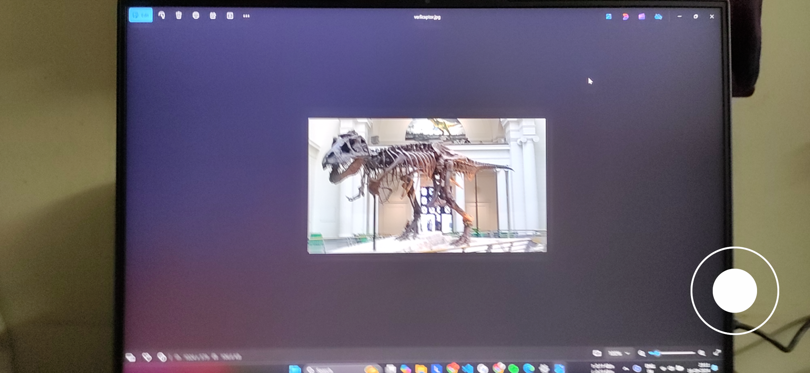
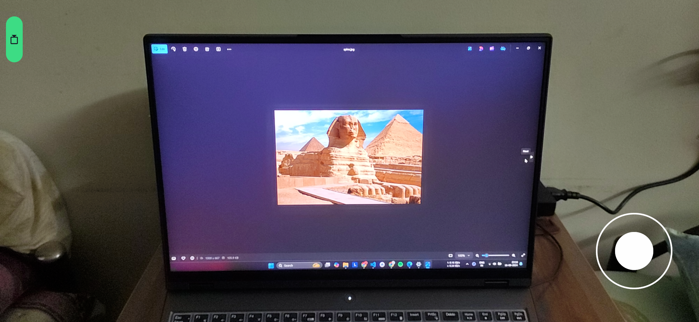
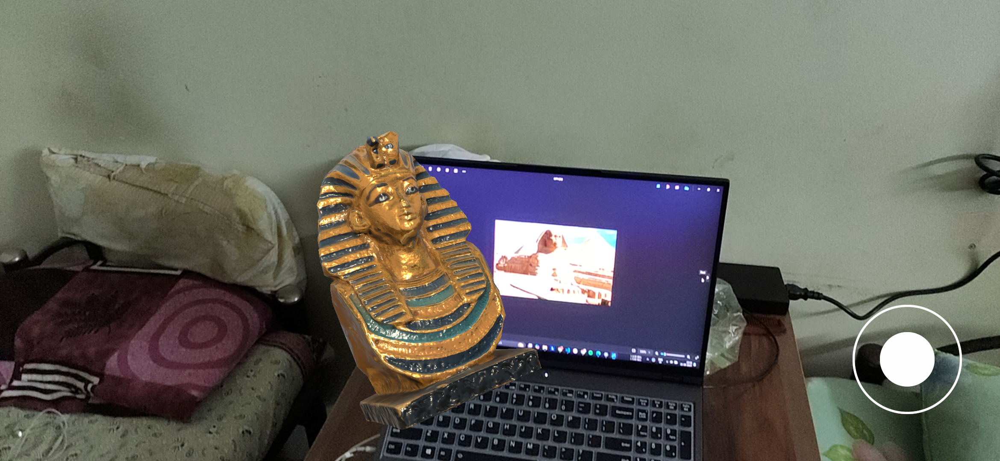
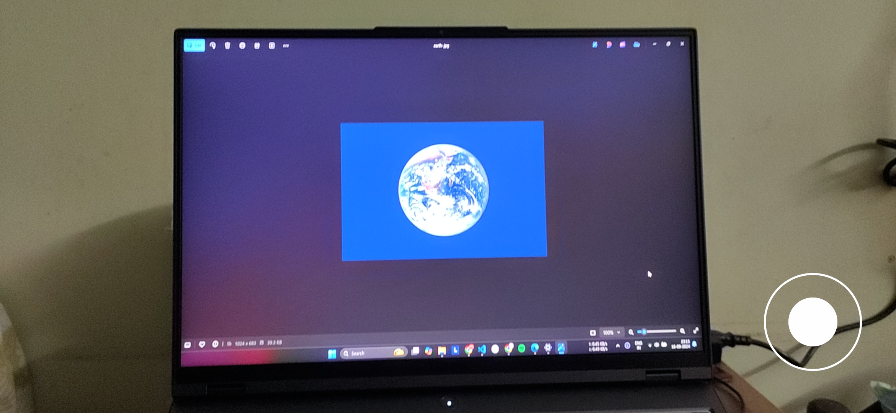
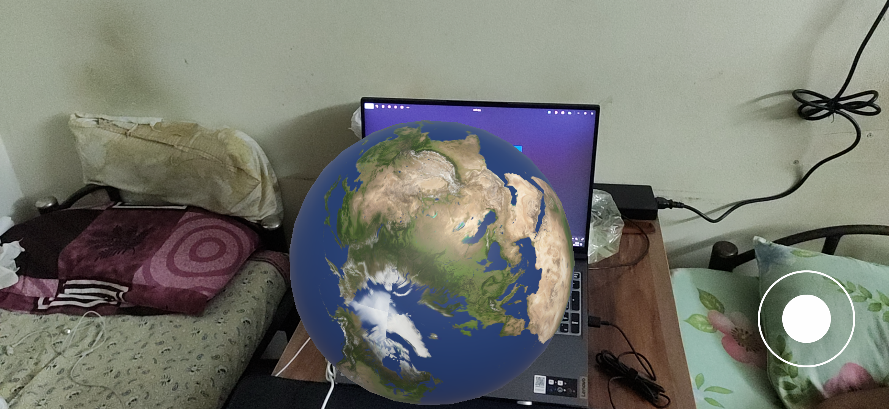
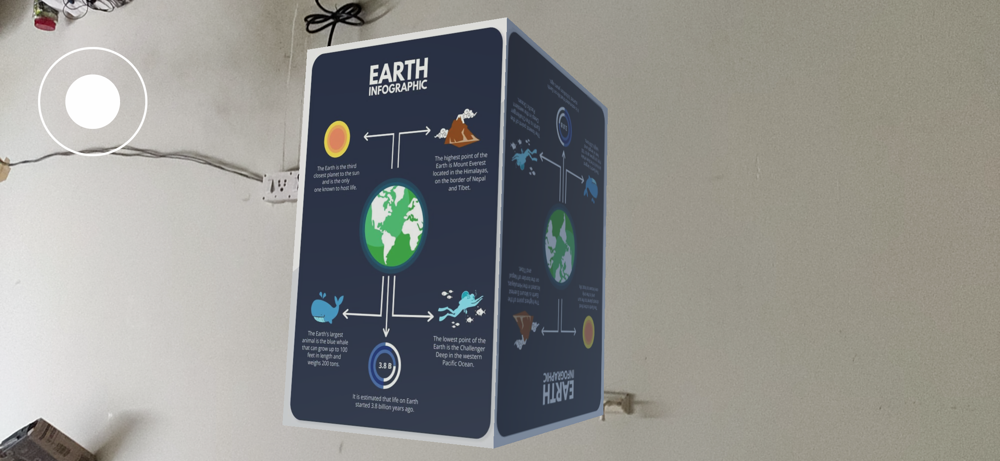

PROJECT: ARtifacts - AR Based Museum Application
====================================================
Traditional Museum visits involve watching the Artifacts along with their infoboards either hanged on the wall or take up space on the ground with the help of stands which takes up a lot of space in the museum. 
This space can be used to display more exhibits and valuable information about some other exhibit. 
Also the fossils that are present as the exhibit in the museum only gives a vague idea about the exticnt animal/bird/insect looks and their body structure like when they were alive in large numbers. 
ARtifacts application give the visitors and immersive experince ast they also get to witness the above mentioned point without making the Museum owner worry about available space.   

The ARtifacts Application is an innovative mobile app designed to transform the traditional museum visit through the power of augmented reality (AR). 
Visitors can make use of their available smartphones with them which will enable them to scan the artifacts, that will trigger the generation of detailed 3D model and  
display relevant related comprehensive information about each artifact.  
This project is developed with the aim to enhance the educational and interactive experience of museum-visitors/audience by integrating advanced AR technologies within the app.  

User's Feature
----------------------

    1. Scanning the Artifacts of the Museum.
    2. Generation of 3D model of the same Artifact.
    3. Interacting with the generated model to gain different perspective of the model.
    4. Making the Artifact move in the real world with the help of the given joystick in the application.
    5. Ganning enhanced knowledge about the exhibit through digital infoboard available in the application.  

Staff's Feature
----------------------

    1. Updating an exhibits information/adding additonal information about the same ARtifacts.
    2. Adding new exhibits along with their Augmented Reality 3D models in the museum.
    3. Making some information limited to VIP visitors or putting age restrictions to it.

 

Screenshots
----------------------
 
 
 
 
 
 
 
 

  

